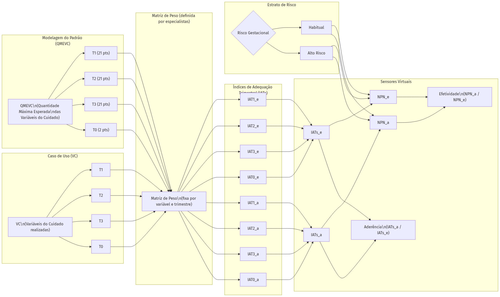
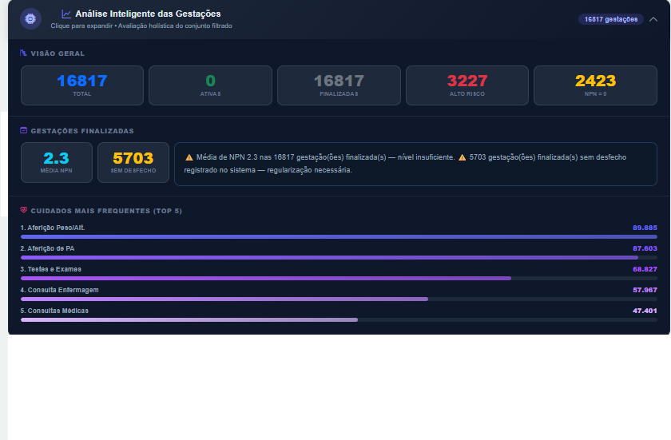
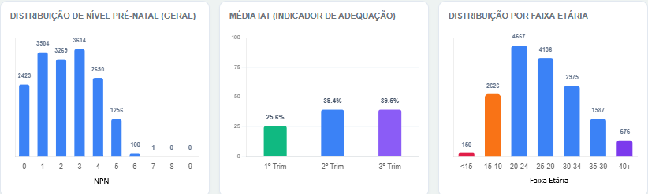

# Metodologia NPN (Nível de Pré-Natal) — Material Suplementar

Este repositório contém a documentação metodológica suplementar, resultados empíricos, matriz de peso e códigos de demonstração referentes ao artigo **"Sensores Virtuais para Síntese de Variáveis do Cuidado Pré-Natal: Metodologia de Especificação de Índices Preditivos para Aprendizado de Máquina"** (CBIS 2026).

## Resumo do Projeto

Algoritmos de aprendizado de máquina aplicados à saúde materno-infantil dependem de variáveis preditoras que capturem a oportunidade temporal dos cuidados clínicos. Este projeto propõe a especificação de **Sensores Virtuais** — instrumentos de medição definidos por software — que sintetizam 65 pontos de observação clínica do cuidado pré-natal em índices contínuos e normalizados, prontos para algoritmos de estratificação de risco gestacional.

A metodologia opera em seis camadas:
1. Padrão esperado de cuidado (QMEVC)
2. Captura das variáveis realizadas (VC)
3. Ponderação por Matriz de Peso
4. Índices de Adequação Trimestral (IAT) com efeito de teto
5. Escore composto (NPN, escala 0–9)
6. Sensores comparativos (aderência e efetividade)

---

## Resultados Empíricos (DUM 2025)

Os resultados referem-se ao recorte de gestações finalizadas com DUM em 2025 na rede da SEMSA/Manaus, avaliadas pela metodologia NPN. O modelo operacionalizou Sensores Virtuais capazes de sintetizar dezenas de variáveis clínicas em indicadores contínuos de adequação assistencial. 

Para a análise detalhada da coorte de **16.817 gestações**, da performance dos Índices de Adequação Trimestral (IATs), da demografia e das conclusões metodológicas que embasaram os Sensores Virtuais aplicados, consulte o documento completo:

👉 **[Ler a Análise Detalhada de Resultados Empíricos (SEMSA/Manaus)](resultados_empiricos.md)**

### Gráficos de Resultados

---

## Organização do Repositório

- `/img`: Contém o diagrama arquitetural em alta resolução e os gráficos de resultados da aplicação na coorte de 2025.
- `/metodologia`: Contém a [Matriz de Peso](metodologia/matriz_de_peso.md), detalhando a ponderação utilizada na Camada 3 do modelo para cada um dos procedimentos nos trimestres da gestação.
- `/app`: Contém uma interface interativa de demonstração em HTML, Javascript e CSS, que simula o cálculo em tempo real das camadas operacionais (QMEVC, VC, Matriz de Peso e IATs) rodando diretamente no navegador, sem necessidade de servidores. Se você baixar o repositório e abrir localmente, poderá fazer upload do CSV manualmente. Se acessar via GitHub Pages, o carregamento é automático.

---

*Repositório criado como anexo técnico-metodológico para avaliação por pares do XXI Congresso Brasileiro de Informática em Saúde (CBIS'26).*
